# Art assets: Flux conversion tracker

Every procedural SVG asset in `src/art/`, and its painted replacement rendered with Cloudflare Workers AI `@cf/black-forest-labs/flux-2-klein-4b`.
The game uses a painted image as soon as its file exists in `src/art/gen/` and falls back to the SVG art otherwise (see `src/art/gen.ts`), so a partly converted set ships safely.

This file is regenerated by `scripts/flux/render.mjs` after every asset. Edit prompts in `scripts/flux/prompts.mjs`.

**132 / 258 converted.** About 3,458 neurons of work left (free tier: 10,000 a day, reset 00:00 UTC).

Last run: 2026-11-25 02:18 UTC, 126 rendered, stopped because: daily neuron limit (4006: AiError: AiError: you have used up your daily free allocation of 10,000 neurons, please upgrade to Cloudflare's Workers Paid plan if you would like to continue usage. (51ff687b-464a-4b9d-abe9-6d2179b9d813)).

| Class | Done | Total | Render size | Stored size | Neurons each |
| --- | ---: | ---: | --- | --- | ---: |
| Location backdrops | 10 | 10 | 1024×640 | 1024×640 WebP | ~104 |
| Portraits | 10 | 12 | 768×768 | 512×512 WebP | ~104 |
| Card stills | 111 | 112 | 768×480 | 640×400 WebP | ~52 |
| Map node icons | 1 | 45 | 512×512 | 160×160 WebP | ~26 |
| Item icons | 0 | 79 | 512×512 | 128×128 WebP | ~26 |

Status: ✅ done · ⬜ pending · 🚩 flagged by the model's output filter (reword the prompt and rerun with `--retry-flagged`) · ❌ error

## Location backdrops

| | Asset | Preview | Rendered |
| --- | --- | --- | --- |
| ✅ | `backdrop/drivein` |  | 2026-11-25 01:59 |
| ✅ | `backdrop/coast` |  | 2026-11-25 01:59 |
| ✅ | `backdrop/hospital` |  | 2026-11-25 01:59 |
| ✅ | `backdrop/snow` | 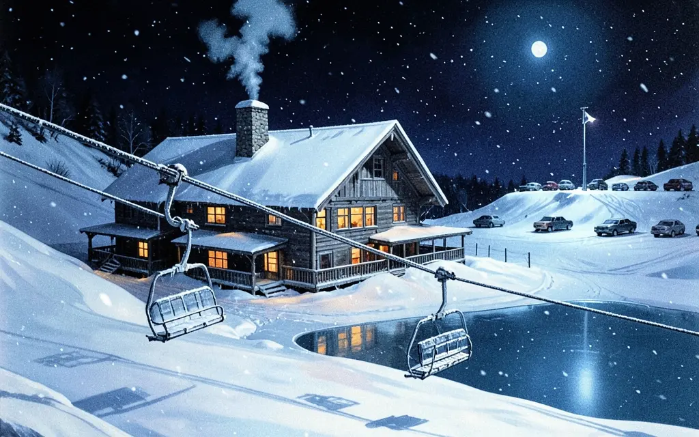 | 2026-11-25 02:00 |
| ✅ | `backdrop/radio` |  | 2026-11-25 02:00 |
| ✅ | `backdrop/drivein-finale` | 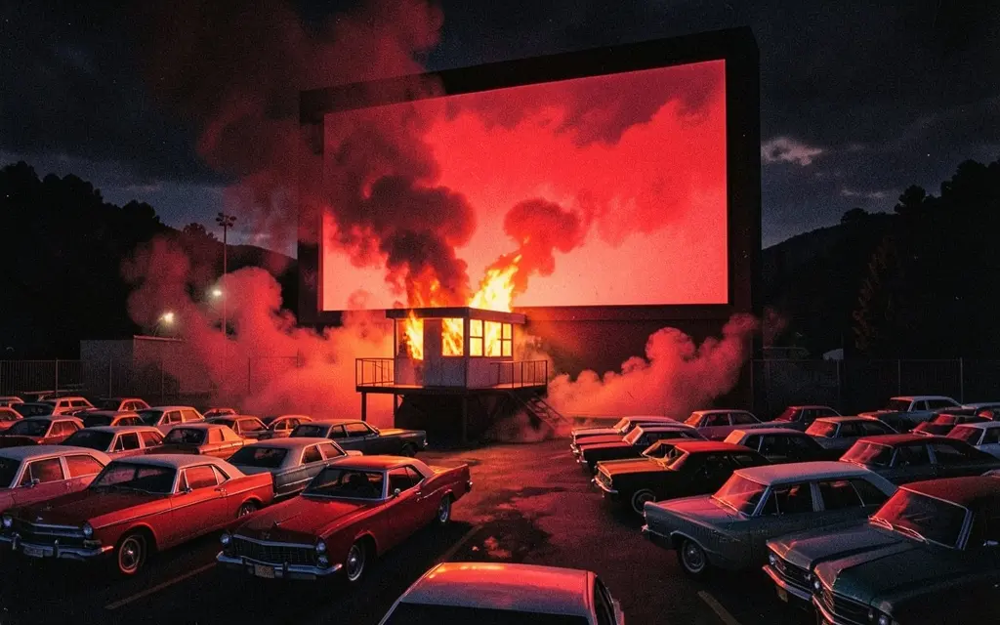 | 2026-11-25 02:03 |
| ✅ | `backdrop/coast-finale` | 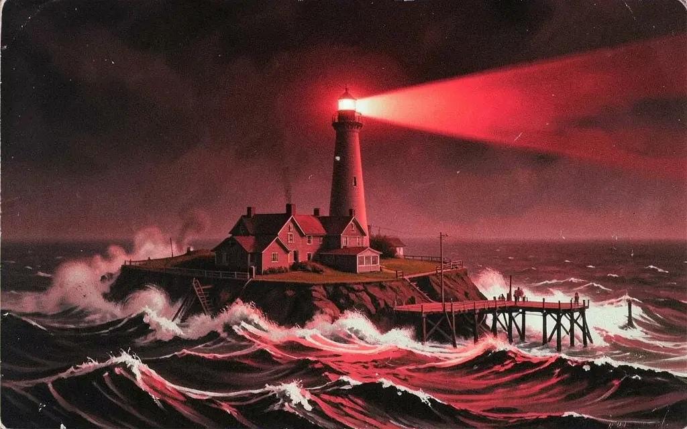 | 2026-11-25 02:03 |
| ✅ | `backdrop/hospital-finale` | 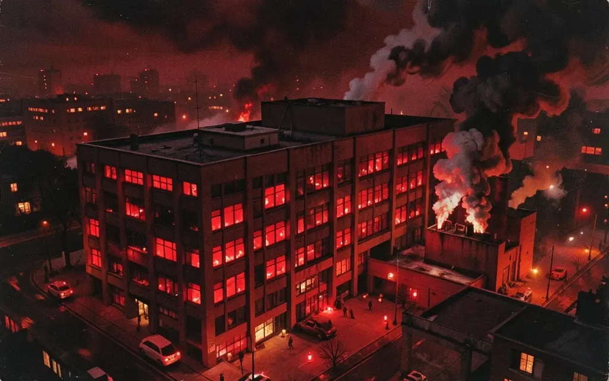 | 2026-11-25 02:03 |
| ✅ | `backdrop/snow-finale` | 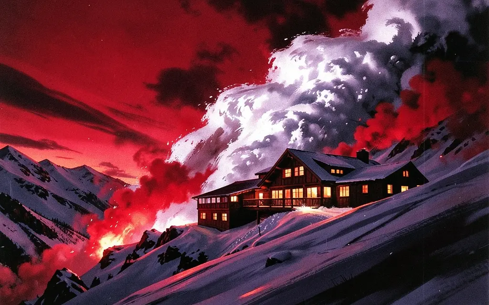 | 2026-11-25 02:03 |
| ✅ | `backdrop/radio-finale` | 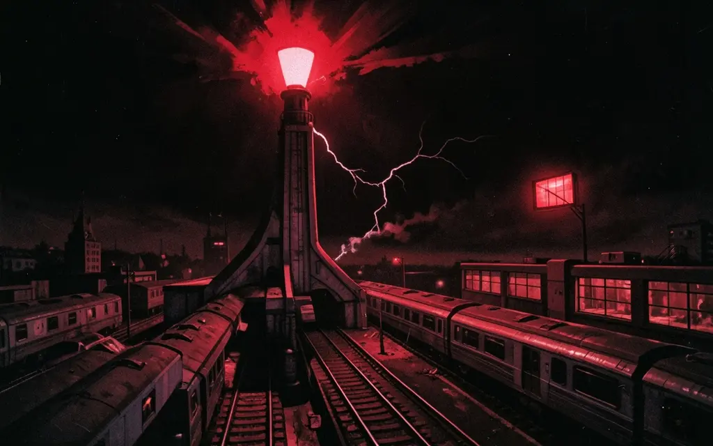 | 2026-11-25 02:03 |

## Portraits

| | Asset | Preview | Rendered |
| --- | --- | --- | --- |
| ✅ | `portrait/heroine-rosa` |  | 2026-11-25 02:01 |
| ✅ | `portrait/heroine-june` |  | 2026-11-25 02:01 |
| ✅ | `portrait/heroine-margo` |  | 2026-11-25 02:01 |
| ✅ | `portrait/heroine-tess` |  | 2026-11-25 02:01 |
| ✅ | `portrait/heroine-ivy` |  | 2026-11-25 02:01 |
| ✅ | `portrait/heroine-sunny` |  | 2026-11-25 02:01 |
| 🚩 | `portrait/heroine-dee` |  | 3030: output flagged |
| 🚩 | `portrait/killer-projectionist` |  | 3030: output flagged |
| ✅ | `portrait/killer-tidewife` |  | 2026-11-25 02:02 |
| ✅ | `portrait/killer-anesthetist` |  | 2026-11-25 02:02 |
| ✅ | `portrait/killer-snowblind` |  | 2026-11-25 02:02 |
| ✅ | `portrait/killer-caller` |  | 2026-11-25 02:02 |

## Card stills

| | Asset | Preview | Rendered |
| --- | --- | --- | --- |
| ✅ | `still/kv-frontrow` | 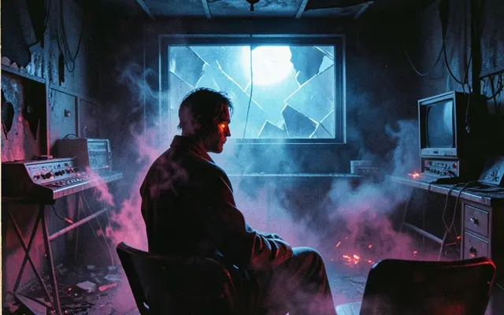 | 2026-11-25 02:03 |
| ✅ | `still/kv-reelchange` |  | 2026-11-25 02:03 |
| ✅ | `still/kv-countdown` |  | 2026-11-25 02:03 |
| ✅ | `still/kv-splice` | 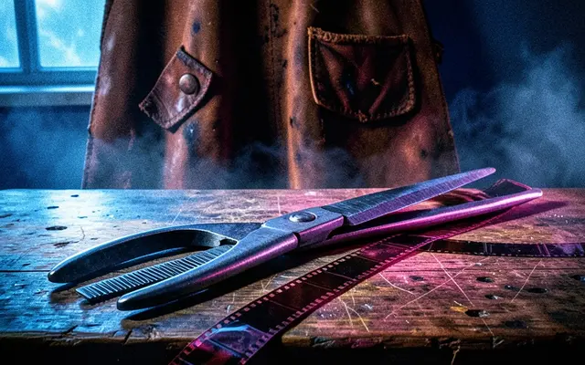 | 2026-11-25 02:04 |
| ✅ | `still/kv-onscreen` |  | 2026-11-25 02:04 |
| ✅ | `still/kv-burn` | 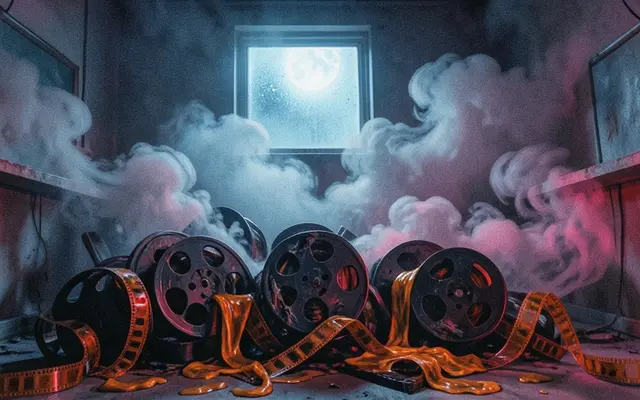 | 2026-11-25 02:04 |
| ✅ | `still/kv-logbook` |  | 2026-11-25 02:04 |
| ✅ | `still/kv-silence` | 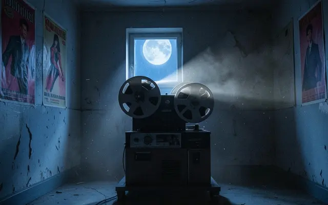 | 2026-11-25 02:04 |
| ✅ | `still/ev-headlights` | 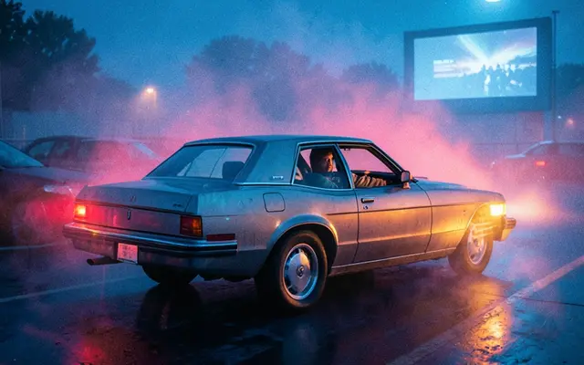 | 2026-11-25 02:04 |
| ✅ | `still/ev-backseat` |  | 2026-11-25 02:04 |
| ✅ | `still/ev-swings` | 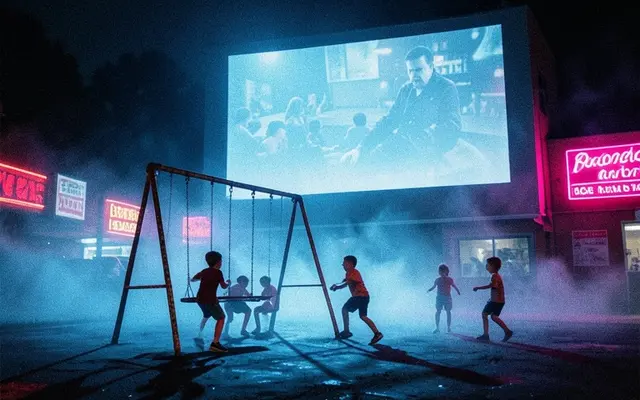 | 2026-11-25 02:04 |
| ✅ | `still/ev-usher` |  | 2026-11-25 02:05 |
| ✅ | `still/ev-second` |  | 2026-11-25 02:05 |
| ✅ | `still/ev-campers` | 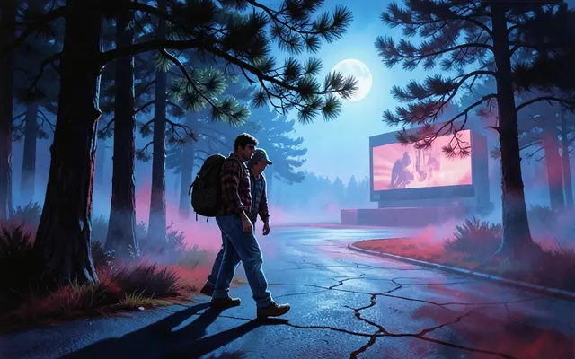 | 2026-11-25 02:05 |
| ✅ | `still/ev-intermission` |  | 2026-11-25 02:05 |
| ✅ | `still/ev-caralarm` | 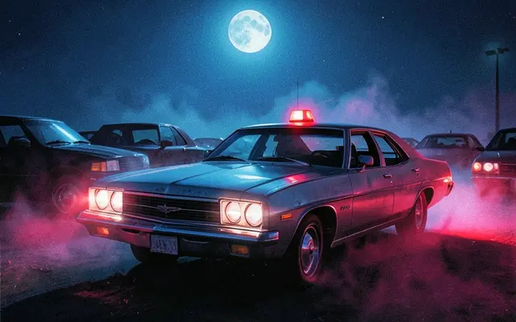 | 2026-11-25 02:05 |
| ✅ | `still/ev-popcorn` | 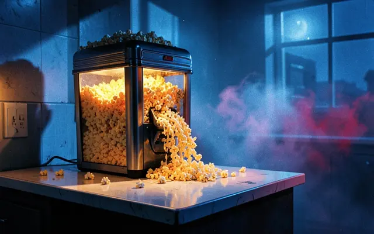 | 2026-11-25 02:05 |
| ✅ | `still/ev-sprinklers` |  | 2026-11-25 02:06 |
| ✅ | `still/ev-trucker` | 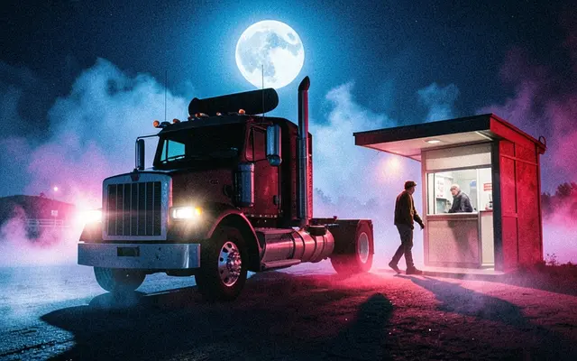 | 2026-11-25 02:06 |
| ✅ | `still/ev-speaker` | 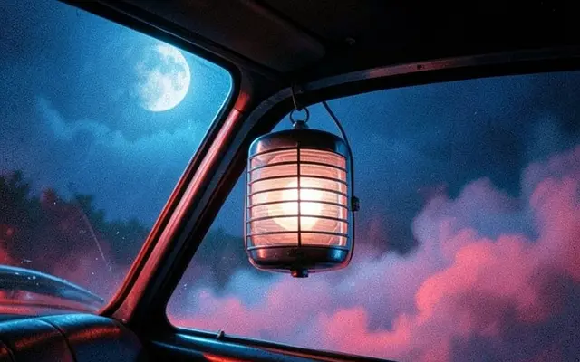 | 2026-11-25 02:06 |
| ✅ | `still/ev-fog` |  | 2026-11-25 02:06 |
| ✅ | `still/ev-moon` | 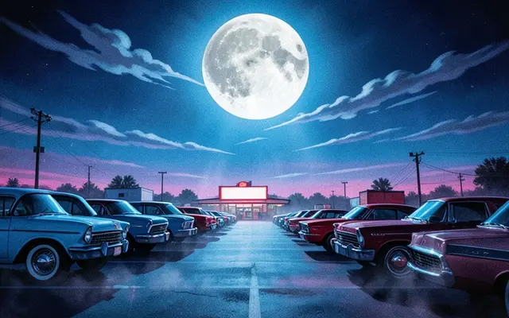 | 2026-11-25 02:06 |
| ✅ | `still/ev-power` |  | 2026-11-25 02:06 |
| ✅ | `still/tw-shallows` |  | 2026-11-25 02:06 |
| ✅ | `still/tw-undertow` |  | 2026-11-25 02:06 |
| ✅ | `still/tw-lamp` |  | 2026-11-25 02:06 |
| ✅ | `still/tw-wet` | 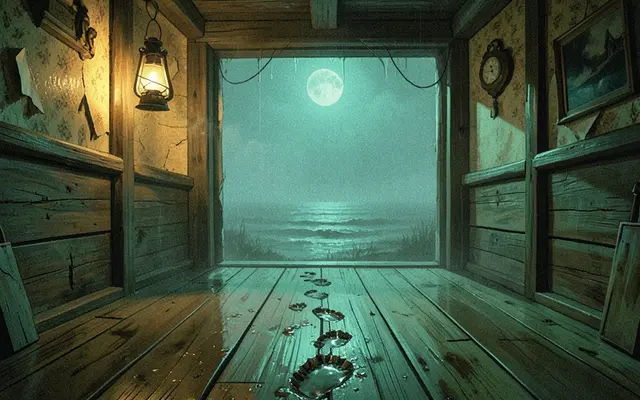 | 2026-11-25 02:07 |
| ✅ | `still/tw-hymn` | 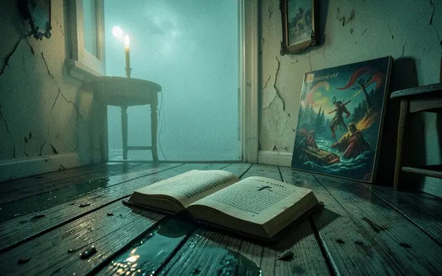 | 2026-11-25 02:07 |
| ✅ | `still/tw-hook` | 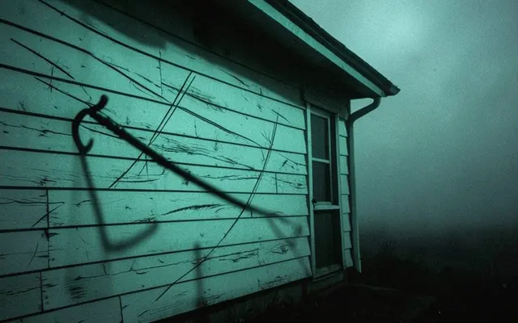 | 2026-11-25 02:07 |
| ✅ | `still/tw-return` | 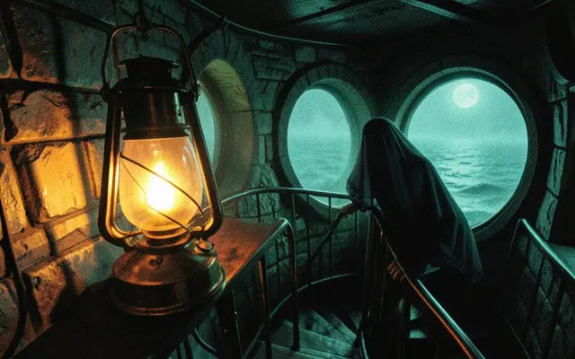 | 2026-11-25 02:07 |
| ✅ | `still/tw-weeping` | 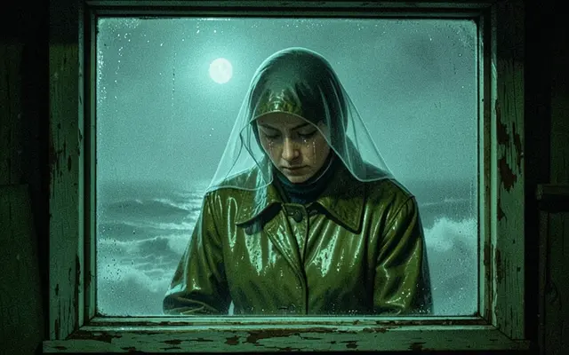 | 2026-11-25 02:07 |
| ✅ | `still/tc-bonfire` | 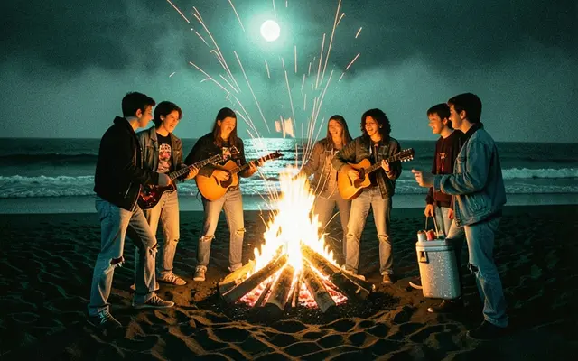 | 2026-11-25 02:07 |
| ✅ | `still/tc-latecheckin` |  | 2026-11-25 02:07 |
| ✅ | `still/tc-fishermen` | 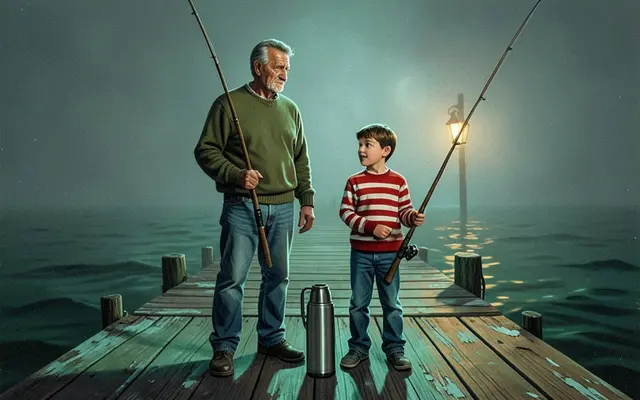 | 2026-11-25 02:08 |
| ✅ | `still/tc-honeymoon` |  | 2026-11-25 02:08 |
| ✅ | `still/tc-kids` | 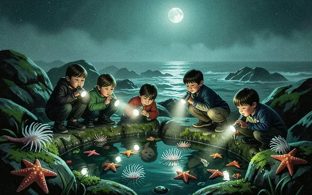 | 2026-11-25 02:08 |
| ✅ | `still/tc-dunes` |  | 2026-11-25 02:08 |
| ✅ | `still/tc-hightide` |  | 2026-11-25 02:08 |
| ✅ | `still/tc-ebb` |  | 2026-11-25 02:08 |
| ✅ | `still/tc-coastguard` |  | 2026-11-25 02:08 |
| ✅ | `still/tc-bell` |  | 2026-11-25 02:08 |
| ✅ | `still/tc-sheets` |  | 2026-11-25 02:09 |
| ✅ | `still/tc-foghorn` |  | 2026-11-25 02:09 |
| ✅ | `still/tc-fogbank` |  | 2026-11-25 02:09 |
| ✅ | `still/tc-moonpath` | 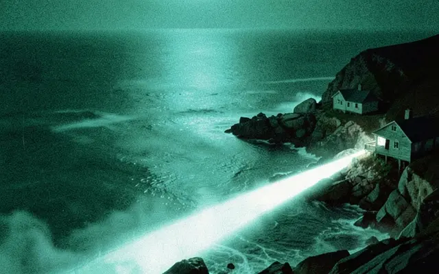 | 2026-11-25 02:09 |
| ✅ | `still/an-sleepwalk` |  | 2026-11-25 02:09 |
| ✅ | `still/an-rounds` |  | 2026-11-25 02:09 |
| ✅ | `still/an-countdown` |  | 2026-11-25 02:09 |
| ✅ | `still/an-ether` | 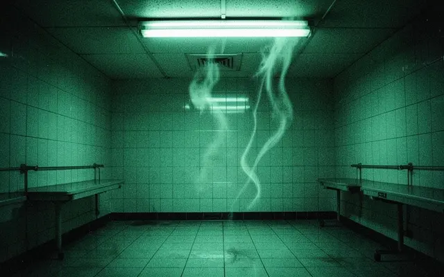 | 2026-11-25 02:09 |
| ✅ | `still/an-paged` |  | 2026-11-25 02:09 |
| ✅ | `still/an-tray` |  | 2026-11-25 02:10 |
| ✅ | `still/an-chart` |  | 2026-11-25 02:10 |
| ✅ | `still/an-scrub` |  | 2026-11-25 02:10 |
| ✅ | `still/sa-transfer` | 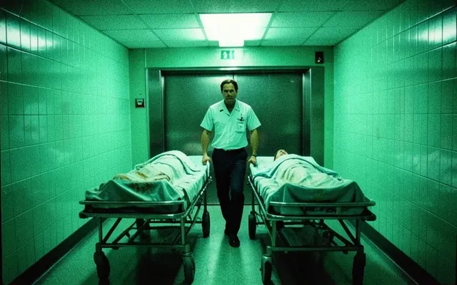 | 2026-11-25 02:10 |
| ✅ | `still/sa-kids` |  | 2026-11-25 02:10 |
| ✅ | `still/sa-intern` |  | 2026-11-25 02:10 |
| ✅ | `still/sa-chaplain` |  | 2026-11-25 02:10 |
| ✅ | `still/sa-walkin` | 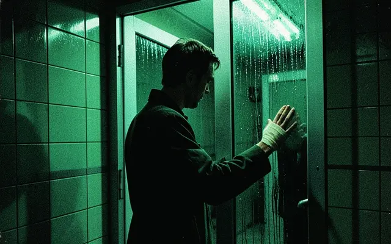 | 2026-11-25 02:10 |
| ✅ | `still/sa-janitor` | 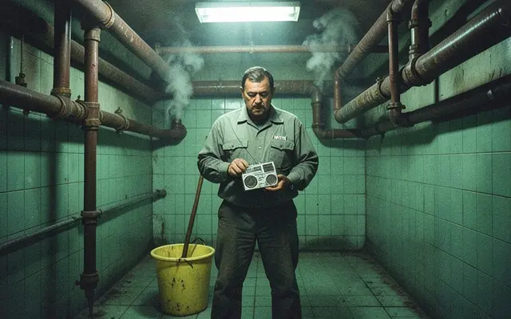 | 2026-11-25 02:11 |
| ✅ | `still/sa-codeblue` |  | 2026-11-25 02:11 |
| ✅ | `still/sa-flicker` | 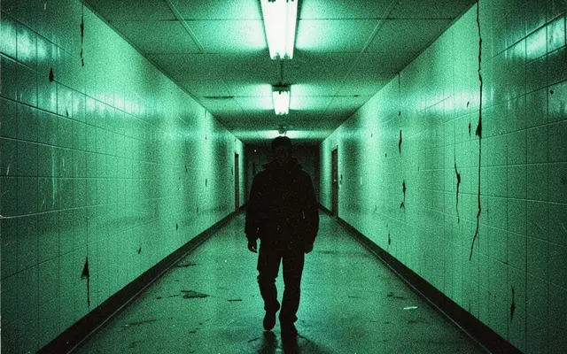 | 2026-11-25 02:11 |
| ✅ | `still/sa-elevator` |  | 2026-11-25 02:11 |
| ✅ | `still/sa-coffee` |  | 2026-11-25 02:11 |
| ✅ | `still/sa-sirens` |  | 2026-11-25 02:11 |
| ✅ | `still/sa-crashcart` |  | 2026-11-25 02:11 |
| ✅ | `still/sa-musicbox` | 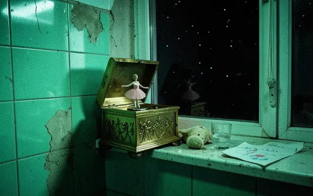 | 2026-11-25 02:12 |
| ✅ | `still/sa-generator` | 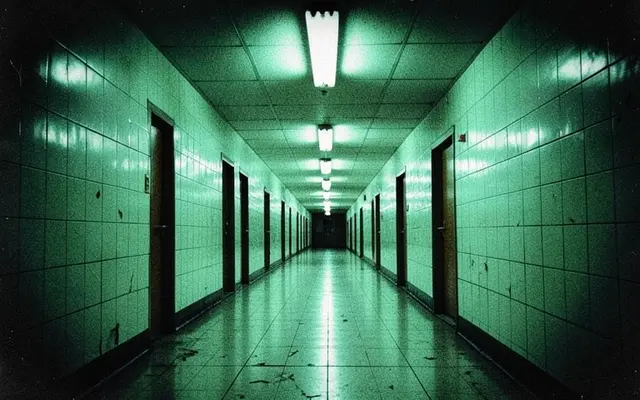 | 2026-11-25 02:12 |
| ✅ | `still/sa-steam` | 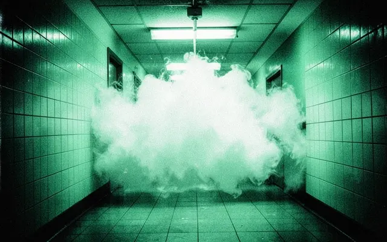 | 2026-11-25 02:12 |
| ✅ | `still/sb-dugout` |  | 2026-11-25 02:12 |
| ✅ | `still/sb-siren` |  | 2026-11-25 02:12 |
| ✅ | `still/sb-whiteout` | 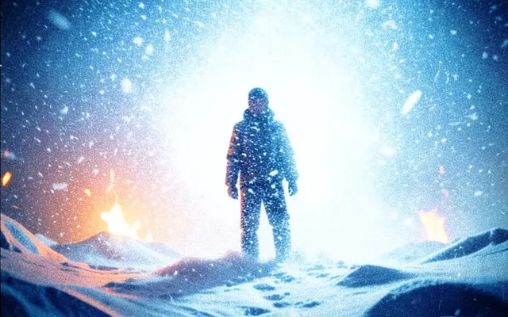 | 2026-11-25 02:12 |
| ✅ | `still/sb-listen` | 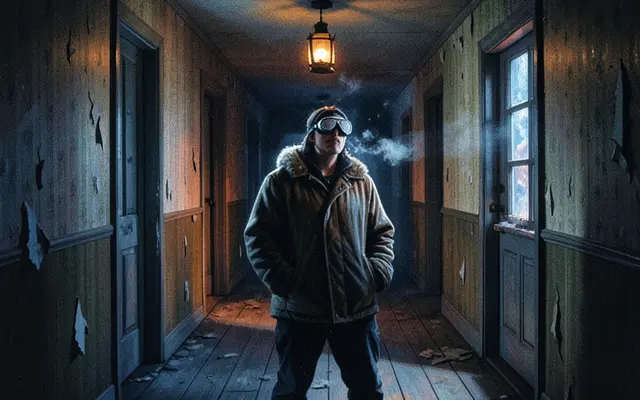 | 2026-11-25 02:12 |
| ✅ | `still/sb-probe` | 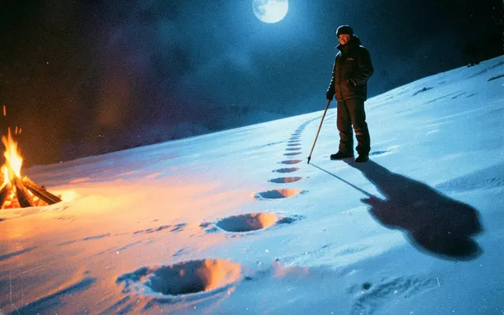 | 2026-11-25 02:12 |
| ✅ | `still/sb-axe` | 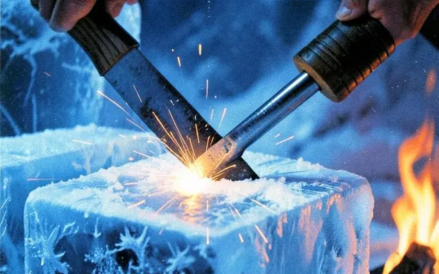 | 2026-11-25 02:13 |
| ✅ | `still/sb-patrol` |  | 2026-11-25 02:13 |
| ✅ | `still/sb-thaw` | 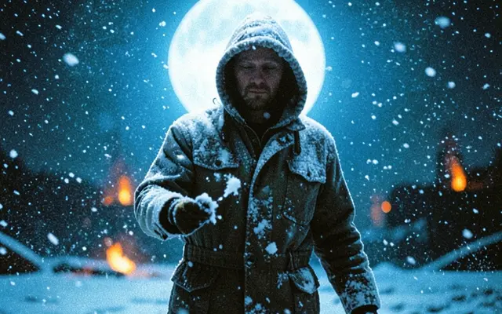 | 2026-11-25 02:13 |
| ✅ | `still/wl-team` |  | 2026-11-25 02:13 |
| ✅ | `still/wl-hottub` |  | 2026-11-25 02:13 |
| ✅ | `still/wl-nightski` | 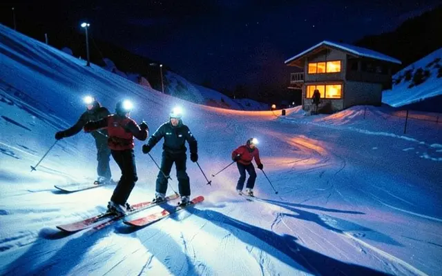 | 2026-11-25 02:13 |
| ✅ | `still/wl-bus` | 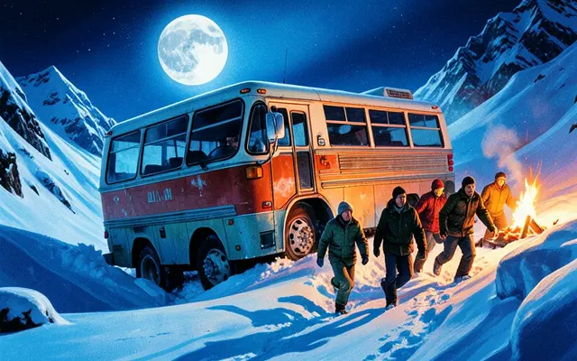 | 2026-11-25 02:13 |
| ✅ | `still/wl-skater` |  | 2026-11-25 02:14 |
| ✅ | `still/wl-bartender` |  | 2026-11-25 02:14 |
| ✅ | `still/wl-lines` | 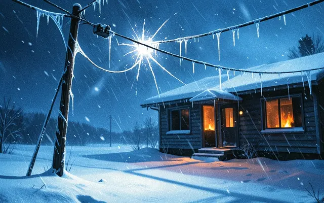 | 2026-11-25 02:14 |
| ✅ | `still/wl-headlights` | 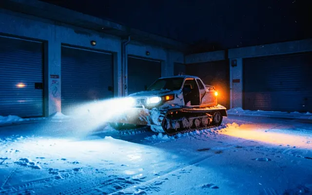 | 2026-11-25 02:14 |
| ✅ | `still/wl-fire` |  | 2026-11-25 02:14 |
| ✅ | `still/wl-cocoa` |  | 2026-11-25 02:14 |
| ✅ | `still/wl-plow` | 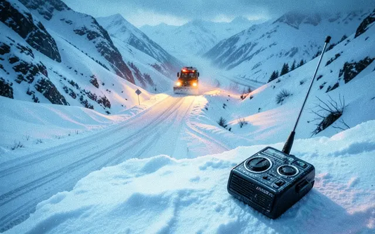 | 2026-11-25 02:14 |
| ✅ | `still/wl-howl` |  | 2026-11-25 02:14 |
| ✅ | `still/wl-drift` |  | 2026-11-25 02:15 |
| ✅ | `still/wl-stars` |  | 2026-11-25 02:15 |
| ✅ | `still/cl-fans` |  | 2026-11-25 02:15 |
| ✅ | `still/cl-ring` | 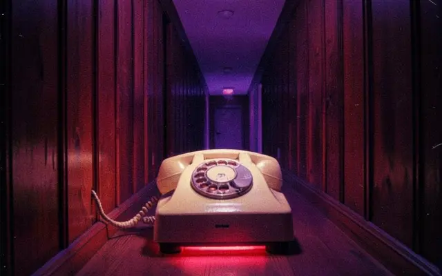 | 2026-11-25 02:15 |
| ✅ | `still/cl-deadair` |  | 2026-11-25 02:15 |
| ✅ | `still/cl-line` |  | 2026-11-25 02:15 |
| ✅ | `still/cl-dedication` | 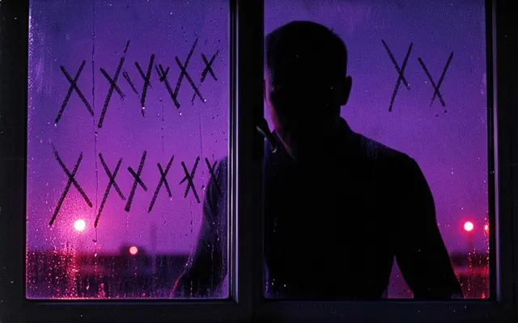 | 2026-11-25 02:15 |
| ✅ | `still/cl-cord` | 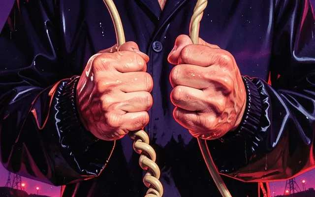 | 2026-11-25 02:15 |
| ✅ | `still/cl-signal` | 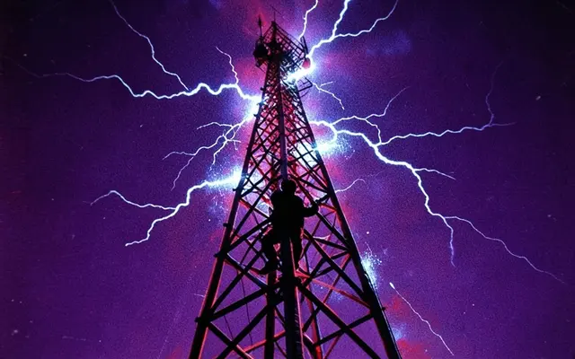 | 2026-11-25 02:16 |
| ✅ | `still/cl-hold` | 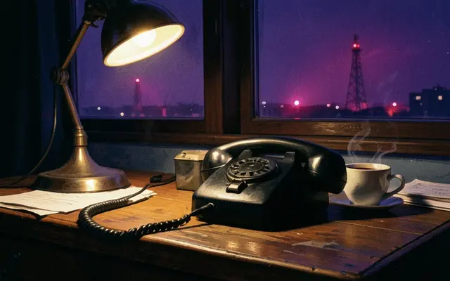 | 2026-11-25 02:16 |
| ✅ | `still/da-winners` |  | 2026-11-25 02:16 |
| ✅ | `still/da-engineer` | 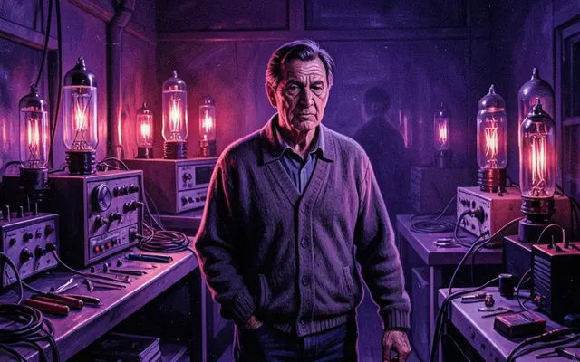 | 2026-11-25 02:16 |
| ✅ | `still/da-dare` | 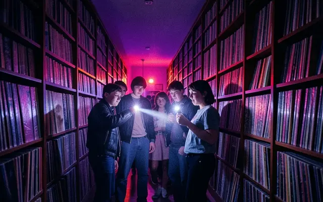 | 2026-11-25 02:16 |
| ✅ | `still/da-newsman` |  | 2026-11-25 02:16 |
| ✅ | `still/da-motorist` |  | 2026-11-25 02:16 |
| ✅ | `still/da-board` | 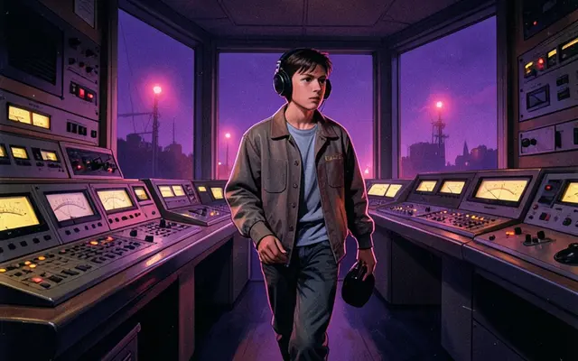 | 2026-11-25 02:16 |
| ✅ | `still/da-lightning` |  | 2026-11-25 02:17 |
| ✅ | `still/da-yourname` | 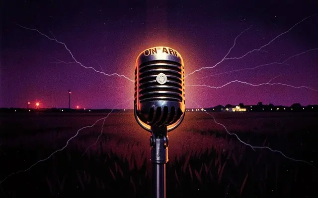 | 2026-11-25 02:17 |
| ✅ | `still/da-jingle` |  | 2026-11-25 02:17 |
| ✅ | `still/da-bulletin` | 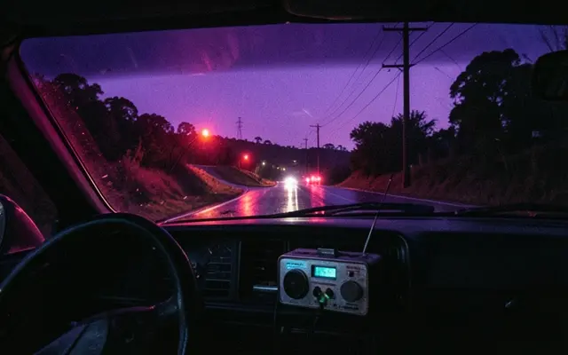 | 2026-11-25 02:17 |
| 🚩 | `still/da-coffee` |  | 3030: output flagged |
| ✅ | `still/da-feedback` | 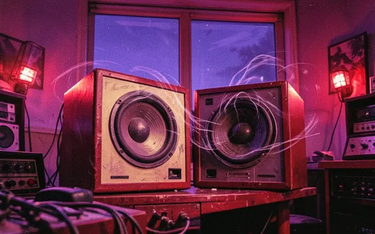 | 2026-11-25 02:17 |
| ✅ | `still/da-storm` | 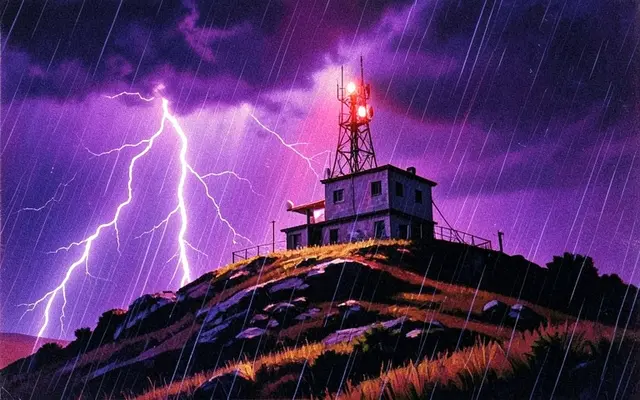 | 2026-11-25 02:17 |
| ✅ | `still/da-moon` | 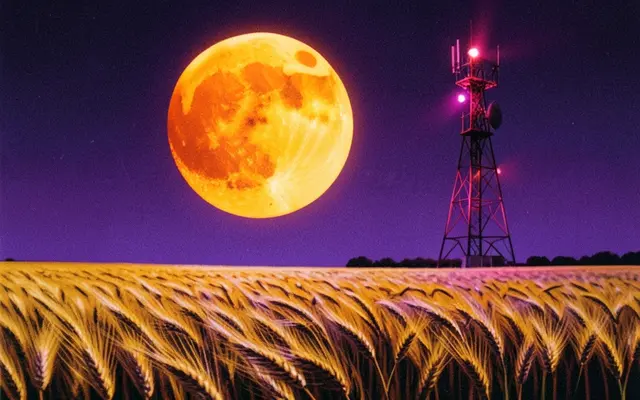 | 2026-11-25 02:17 |

## Map node icons

| | Asset | Preview | Rendered |
| --- | --- | --- | --- |
| ✅ | `icon/ambulance` |  | 2026-11-25 02:18 |
| ⬜ | `icon/bear` |  |  |
| ⬜ | `icon/boat` |  |  |
| ⬜ | `icon/bolt` |  |  |
| ⬜ | `icon/cabin` |  |  |
| ⬜ | `icon/candle` |  |  |
| ⬜ | `icon/car` |  |  |
| ⬜ | `icon/chair` |  |  |
| ⬜ | `icon/cross` |  |  |
| ⬜ | `icon/desk` |  |  |
| ⬜ | `icon/dial` |  |  |
| ⬜ | `icon/dock` |  |  |
| ⬜ | `icon/door` |  |  |
| ⬜ | `icon/drawer` |  |  |
| ⬜ | `icon/elevator` |  |  |
| ⬜ | `icon/files` |  |  |
| ⬜ | `icon/gate` |  |  |
| ⬜ | `icon/glass` |  |  |
| ⬜ | `icon/grass` |  |  |
| ⬜ | `icon/hearth` |  |  |
| ⬜ | `icon/hook` |  |  |
| ⬜ | `icon/ice` |  |  |
| ⬜ | `icon/lamp` |  |  |
| ⬜ | `icon/lighthouse` |  |  |
| ⬜ | `icon/mic` |  |  |
| ⬜ | `icon/mug` |  |  |
| ⬜ | `icon/payphone` |  |  |
| ⬜ | `icon/peak` |  |  |
| ⬜ | `icon/pill` |  |  |
| ⬜ | `icon/pine` |  |  |
| ⬜ | `icon/pipe` |  |  |
| ⬜ | `icon/popcorn` |  |  |
| ⬜ | `icon/pot` |  |  |
| ⬜ | `icon/projector` |  |  |
| ⬜ | `icon/record` |  |  |
| ⬜ | `icon/screen` |  |  |
| ⬜ | `icon/shed` |  |  |
| ⬜ | `icon/ski` |  |  |
| ⬜ | `icon/snowcat` |  |  |
| ⬜ | `icon/steam` |  |  |
| ⬜ | `icon/swing` |  |  |
| ⬜ | `icon/ticket` |  |  |
| ⬜ | `icon/tower` |  |  |
| ⬜ | `icon/wave` |  |  |
| ⬜ | `icon/wreck` |  |  |

## Item icons

| | Asset | Preview | Rendered |
| --- | --- | --- | --- |
| ⬜ | `item/orrin-s-logbook` |  |  |
| ⬜ | `item/the-unfinished-reel` |  |  |
| ⬜ | `item/the-keeper-s-last-letter` |  |  |
| ⬜ | `item/wedding-ring-in-the-weed` |  |  |
| ⬜ | `item/ward-c-patient-log` |  |  |
| ⬜ | `item/dr-lull-s-dictaphone` |  |  |
| ⬜ | `item/patrol-report-jan-74` |  |  |
| ⬜ | `item/corder-s-avalanche-beacon` |  |  |
| ⬜ | `item/overnight-call-log` |  |  |
| ⬜ | `item/unaired-reel-to-reel` |  |  |
| ⬜ | `item/tire-iron` |  |  |
| ⬜ | `item/hedge-shears` |  |  |
| ⬜ | `item/groundskeeper-s-shotgun` |  |  |
| ⬜ | `item/road-flare` |  |  |
| ⬜ | `item/fire-extinguisher` |  |  |
| ⬜ | `item/usher-flashlight` |  |  |
| ⬜ | `item/first-aid-tin` |  |  |
| ⬜ | `item/aspirin-cola` |  |  |
| ⬜ | `item/box-of-sugar-candy` |  |  |
| ⬜ | `item/padlock-chain` |  |  |
| ⬜ | `item/walkie-talkie` |  |  |
| ⬜ | `item/station-wagon-keys` |  |  |
| ⬜ | `item/thermos-of-black-coffee` |  |  |
| ⬜ | `item/pulled-speaker-box` |  |  |
| ⬜ | `item/firecrackers` |  |  |
| ⬜ | `item/boat-hook` |  |  |
| ⬜ | `item/fillet-knife` |  |  |
| ⬜ | `item/spear-gun` |  |  |
| ⬜ | `item/marine-flare-gun` |  |  |
| ⬜ | `item/rock-salt` |  |  |
| ⬜ | `item/storm-lantern` |  |  |
| ⬜ | `item/marine-first-aid-kit` |  |  |
| ⬜ | `item/flask-of-brandy` |  |  |
| ⬜ | `item/saltwater-taffy` |  |  |
| ⬜ | `item/mooring-rope` |  |  |
| ⬜ | `item/outboard-key` |  |  |
| ⬜ | `item/jeep-keys` |  |  |
| ⬜ | `item/transistor-radio` |  |  |
| ⬜ | `item/buoy-bell` |  |  |
| ⬜ | `item/scalpel` |  |  |
| ⬜ | `item/fire-axe` |  |  |
| ⬜ | `item/bone-saw` |  |  |
| ⬜ | `item/defibrillator-paddles` |  |  |
| ⬜ | `item/co2-extinguisher` |  |  |
| ⬜ | `item/penlight` |  |  |
| ⬜ | `item/gauze-tape` |  |  |
| ⬜ | `item/mild-sedative` |  |  |
| ⬜ | `item/smelling-salts` |  |  |
| ⬜ | `item/heavy-gurney` |  |  |
| ⬜ | `item/doctor-s-pager` |  |  |
| ⬜ | `item/intercom-handset` |  |  |
| ⬜ | `item/service-elevator-key` |  |  |
| ⬜ | `item/epinephrine-pen` |  |  |
| ⬜ | `item/broken-ski-pole` |  |  |
| ⬜ | `item/climbing-ice-axe` |  |  |
| ⬜ | `item/lodge-hunting-rifle` |  |  |
| ⬜ | `item/avalanche-flare-pistol` |  |  |
| ⬜ | `item/headlamp` |  |  |
| ⬜ | `item/wool-blanket` |  |  |
| ⬜ | `item/hand-warmers` |  |  |
| ⬜ | `item/peppermint-schnapps` |  |  |
| ⬜ | `item/energy-bar` |  |  |
| ⬜ | `item/ski-rack` |  |  |
| ⬜ | `item/spare-transceiver` |  |  |
| ⬜ | `item/air-horn` |  |  |
| ⬜ | `item/snowmobile-keys` |  |  |
| ⬜ | `item/mic-stand` |  |  |
| ⬜ | `item/tower-wrench` |  |  |
| ⬜ | `item/pneumatic-nail-gun` |  |  |
| ⬜ | `item/halon-extinguisher` |  |  |
| ⬜ | `item/heavy-flashlight` |  |  |
| ⬜ | `item/station-first-aid-box` |  |  |
| ⬜ | `item/headache-pills` |  |  |
| ⬜ | `item/birthday-cake` |  |  |
| ⬜ | `item/filing-cabinet` |  |  |
| ⬜ | `item/test-tone-generator` |  |  |
| ⬜ | `item/loaded-cart-tape` |  |  |
| ⬜ | `item/station-van-keys` |  |  |
| ⬜ | `item/two-way-radio` |  |  |
